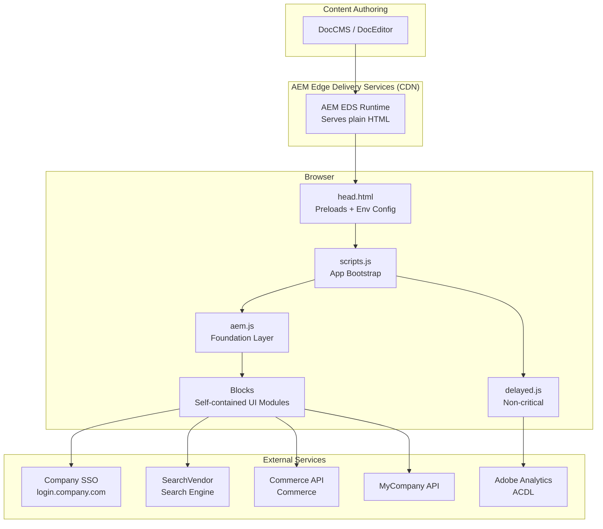
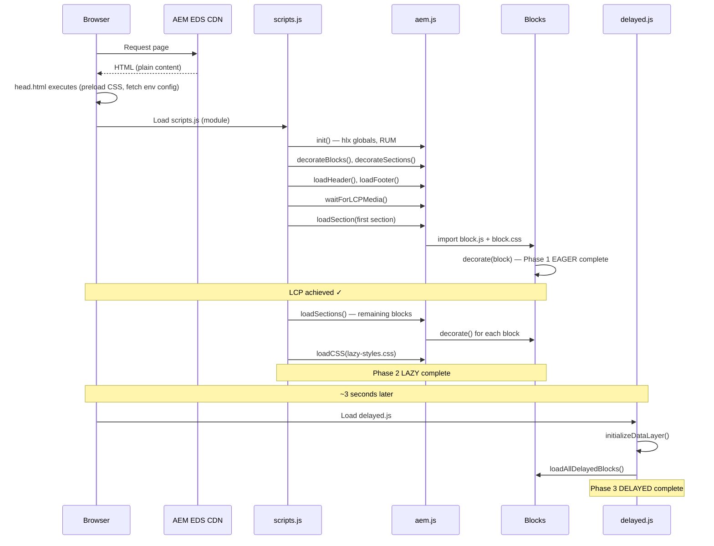
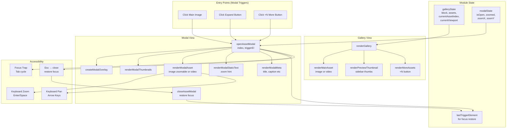
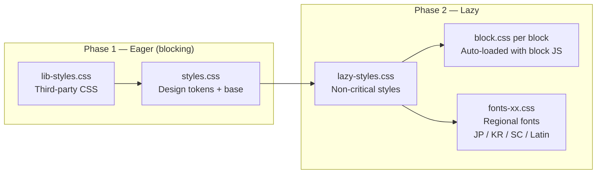
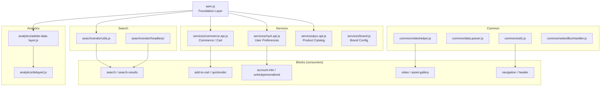
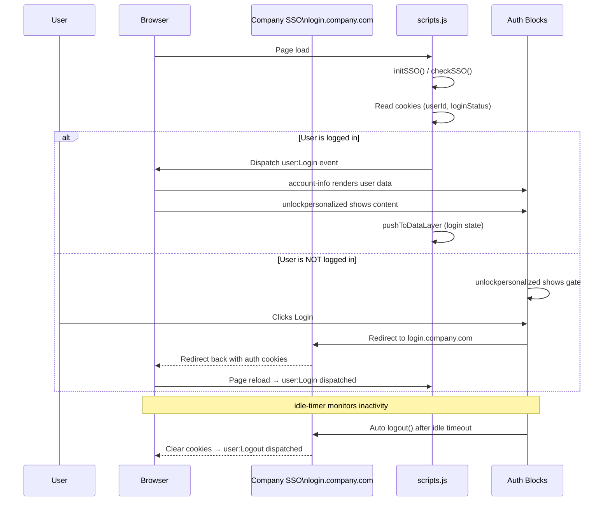
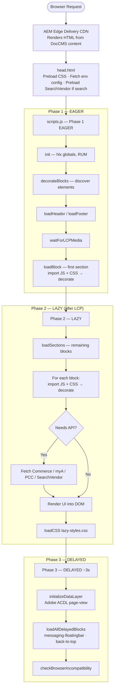

# Architecture Document — Sirius AEM company.com Frontend

> **Project:** `@company/sirius-aem-acom`  
> **Platform:** Adobe Experience Manager (AEM) Edge Delivery Services (EDS) / Franklin  
> **Language:** Vanilla JavaScript (ES Modules), CSS  
> **Author:** Company Technologies

---

## Table of Contents

1. [High-Level System Architecture Diagram](#diagram-1--high-level-system-architecture)
2. [Overview](#1-overview)
3. [Technology Stack](#2-technology-stack)
4. [Repository Structure](#3-repository-structure)
5. [Core Architecture](#4-core-architecture)
   - [4.1 Page Load Lifecycle (Sequence Diagram)](#41-page-load-lifecycle)
   - [4.2 aem.js — The Foundation Layer](#42-aemjs--the-foundation-layer)
   - [4.3 scripts.js — App Bootstrap](#43-scriptsjs--app-bootstrap)
   - [4.4 delayed.js — Non-Critical Loading](#44-delayedjs--non-critical-loading)
6. [Block Architecture](#5-block-architecture)
   - [Block Activation Lifecycle Diagram](#diagram--block-activation-lifecycle)
   - [5.1 Block Anatomy](#51-block-anatomy)
   - [5.2 Block Inventory](#52-block-inventory)
   - [5.3 Block Deep Dive: asset-gallery (Component Diagram)](#53-block-deep-dive-asset-gallery)
7. [Styling Architecture (CSS Loading Diagram)](#6-styling-architecture)
8. [Scripts Layer (Dependency Diagram)](#7-scripts-layer)
   - [7.1 Analytics — Adobe Data Layer](#71-analytics--adobe-data-layer)
   - [7.2 Services — API Layer](#72-services--api-layer)
   - [7.3 Common Utilities](#73-common-utilities)
   - [7.4 Search — SearchVendor Integration](#74-search--searchvendor-integration)
9. [Authentication & SSO (Sequence Diagram)](#8-authentication--sso)
10. [Templates](#9-templates)
11. [Testing Architecture](#10-testing-architecture)
12. [Build & Tooling](#11-build--tooling)
13. [Data Flow Diagram (End-to-End Flowchart)](#12-data-flow-diagram)
14. [Key Design Patterns](#13-key-design-patterns)

---

## Diagram 1 — High-Level System Architecture



---

## 1. Overview

This repository is the **frontend layer** for `company.com`, built on top of **Adobe Experience Manager Edge Delivery Services (EDS)**. EDS is a document-based CMS where content is authored in DocEditor/DocCMS and rendered server-side as plain HTML. The frontend enhances this HTML with interactive behavior via **vanilla JavaScript ES Modules** — no framework, no bundler, no build step for production.

The architecture is deliberately **lightweight and performance-first**: CSS and JS are loaded progressively (eager → lazy → delayed), and each UI component (called a **block**) is a fully self-contained module.

---

## 2. Technology Stack

| Concern        | Technology                                      |
| -------------- | ----------------------------------------------- |
| CMS            | Adobe Experience Manager Edge Delivery Services |
| JavaScript     | Vanilla ES Modules (no framework)               |
| CSS            | Plain CSS with custom properties                |
| Search         | SearchVendor Headless Commerce Engine           |
| Analytics      | Adobe Experience Platform Data Layer            |
| Authentication | Company SSO (`login.company.com`)               |
| Testing        | Jest + jsdom                                    |
| Linting        | ESLint (Airbnb base) + Stylelint                |
| Local Dev      | `aem up` (AEM CLI)                              |

---

## 3. Repository Structure

```
/
├── head.html               # <head> injected into every page — preloads, CSP, env fetch
├── scripts/
│   ├── aem.js              # Core EDS runtime — ALL shared utilities live here
│   ├── scripts.js          # App bootstrap — orchestrates page load phases
│   ├── delayed.js          # Non-critical: analytics, delayed blocks, browser compat
│   ├── analytics/
│   │   ├── adobe-data-layer.js  # Adobe ACDL event tracking
│   │   └── delayed.js           # Analytics deferred init
│   ├── services/
│   │   ├── commerce.api.js           # Commerce commerce API
│   │   ├── myA.api.js           # MyCompany user API
│   │   ├── pcc.api.js           # PCC (product/commerce catalog) API
│   │   └── brand.js             # Brand config service
│   ├── common/
│   │   ├── utils.js             # Shared utility functions
│   │   ├── data.parser.js       # Content/data parsing helpers
│   │   ├── videohelper.js       # Video embed/playback helpers
│   │   ├── selectBoxHandler.js  # Custom select/dropdown logic
│   │   └── marked.esm.js        # Markdown parser
│   ├── atoms/
│   │   └── selectBoxDown.js     # Atomic select dropdown component
│   ├── searchvendor/                   # SearchVendor Headless search engine (vendored)
│   │   ├── headless/            # Headless commerce + search engines
│   │   ├── schema/               # SearchVendor Schema schema validation
│   │   └── utils.js             # SearchVendor configuration helpers
│   ├── lib-js/                  # Third-party JS libraries
│   └── videojs/                 # Video.js player
├── blocks/                      # UI components — each block is self-contained
│   ├── <block-name>/
│   │   ├── <block-name>.js      # Block logic
│   │   └── <block-name>.css     # Block styles
├── styles/
│   ├── styles.css               # Global design tokens + base styles (eager)
│   ├── lib-styles.css           # Third-party / library CSS
│   ├── lazy-styles.css          # Non-critical styles (lazy phase)
│   └── fonts*.css               # Regional font faces (Latin, JP, KR, SC)
├── templates/
│   ├── product-details/         # PDP (Product Detail Page) template
│   └── searchresults/           # Search results page template
├── tests/
│   ├── blocks/                  # Jest unit tests per block
│   └── scripts/                 # Jest unit tests for scripts
├── icons/                       # SVG icons (referenced via <span class="icon icon-*">)
├── fonts/                       # WOFF2 font files
├── apps/                        # Standalone micro-apps (POCs)
│   ├── reports-poc/
│   └── workflow-poc/
├── models/                      # AEM component models (JSON schema for UE)
├── plugins/                     # AEM EDS plugins
└── tools/                       # Dev tooling
```

---

## 4. Core Architecture

### 4.1 Page Load Lifecycle

EDS dictates a **three-phase progressive loading** strategy:



head.html executed
→ preload styles.css, lib-styles.css
→ fetch /.env/config.json (environment config)
→ preload SearchVendor scripts if search page
scripts.js loaded
→ init() — sets up hlx globals, RUM sampling
→ decorateTemplateAndTheme()
→ decorateSections(), decorateBlocks()
→ loadHeader(), loadFooter()
→ waitForLCPMedia() — wait for above-fold image
→ loadSection(firstSection) — renders first section immediately

Phase 2 — LAZY (after LCP)
→ loadSections() — render remaining sections + blocks
→ loadCSS(lazy-styles.css)
→ Each block's decorate() function is called as it enters viewport

Phase 3 — DELAYED (3s after load or on user interaction)
→ delayed.js
→ initializeDataLayer() — Adobe analytics
→ loadAllDelayedBlocks() — messaging-floatingbar, back-to-top
→ checkBrowserIncompatibility()
→ restore scroll position

````

### 4.2 aem.js — The Foundation Layer

`scripts/aem.js` (~2200 lines) is the **single source of truth** for all shared runtime functionality. It is imported by virtually every block and script. Key exports:

| Export | Purpose |
|---|---|
| `html` | Tagged template literal — creates DOM elements from HTML strings |
| `decorateIcons(el)` | Replaces `<span class="icon icon-*">` with inline SVGs |
| `getPlaceholder(key)` | Synchronous i18n string lookup |
| `decorateBlocks()` | Discovers and initialises all blocks on the page |
| `loadBlock(block)` | Dynamically imports a block's JS + CSS |
| `getMetadata(name)` | Reads `<meta>` tags from the page |
| `fetchIndex(path)` | Fetches AEM query index JSON |
| `pushToDataLayer(data)` | Pushes events to `window.adobeDataLayer` |
| `isCDN()` | Detects production CDN vs. local/staging |
| `isLoggedIn()` | Reads SSO login state |
| `getLocale()` | Returns current page locale |
| `getUserInfo()` | Returns cached user profile from SSO |
| `loadEnvConfig()` | Returns parsed environment config from `/.env/config.json` |
| `initSSO() / checkSSO()` | Initialise Company SSO library |
| `getCookie() / setCookie()` | Cookie read/write helpers |
| `sampleRUM()` | Adobe RUM (Real User Monitoring) telemetry |

### 4.3 scripts.js — App Bootstrap

`scripts/scripts.js` is loaded as a module by EDS on every page. It:

1. Calls `init()` to bootstrap the EDS runtime
2. Orchestrates the three load phases described above
3. Sets up **user event listeners** (`user:Login`, `user:Logout`) and pushes corresponding Adobe Data Layer events
4. Loads locale-specific fonts (JP, KR, SC) conditionally based on `<html lang>`
5. Handles SSO state — redirects, cookie management, registration flows

### 4.4 delayed.js — Non-Critical Loading

`scripts/delayed.js` runs ~3 seconds after initial page load:

- **`initializeDataLayer()`** — fires the initial page-view event to Adobe Analytics
- **`loadAllDelayedBlocks()`** — dynamically injects `messaging-floatingbar` and `back-to-top` blocks into the DOM
- **`checkBrowserIncompatibility()`** — loads a CDN script to detect unsupported browsers
- **Scroll position restoration** — handles back-navigation scroll restore from `sessionStorage`

---

## 5. Block Architecture

### Diagram — Block Activation Lifecycle

```mermaid
flowchart TD
    A[AEM EDS serves HTML\n div.my-block] --> B[decorateBlocks in aem.js\ndetects block element]
    B --> C[loadBlock]
    C --> D[Dynamic import\nblocks/my-block/my-block.js\nblocks/my-block/my-block.css]
    D --> E[Call decorate block]
    E --> F[Parse AEM table HTML\ninto structured data]
    F --> G{Needs API data?}
    G -- Yes --> H[Fetch from Commerce / myA / PCC / SearchVendor]
    H --> I[Render interactive UI\ninto DOM]
    G -- No --> I
    I --> J[decorateIcons\nreplace span.icon with SVG]
    J --> K[Block is live ✓]
````

### 5.1 Block Anatomy

Every UI component in EDS is a **block**. Blocks follow a strict convention:

```
blocks/
└── my-block/
    ├── my-block.js      ← Must export default async function decorate(block)
    └── my-block.css     ← Scoped styles, auto-loaded by the runtime
```

**How a block is activated:**

1. AEM renders HTML: `<div class="my-block">...</div>`
2. `decorateBlocks()` in `aem.js` detects this element
3. `loadBlock()` dynamically `import()`s `my-block.js` + `my-block.css`
4. The `decorate(block)` default export is called with the DOM element
5. The block reads the raw HTML table structure (AEM content), transforms it into interactive UI, and writes it back to the DOM

**Key conventions:**

- No external framework — only vanilla JS and native DOM APIs
- `html` tagged template from `aem.js` is the standard way to create DOM fragments
- `decorateIcons(el)` must be called after any SVG icon spans are added
- Blocks are **fully isolated** — they do not share state with other blocks (except via custom events or shared services)
- Optional: blocks can export additional named functions (e.g., `initGalleryWithAssets`) for testing or programmatic use

### 5.2 Block Inventory

| Block                                                             | Category   | Description                            |
| ----------------------------------------------------------------- | ---------- | -------------------------------------- |
| `header` / `header-crosslab`                                      | Navigation | Site-wide header with nav menus        |
| `footer`                                                          | Navigation | Site-wide footer                       |
| `navigation` / `navigation-pdp`                                   | Navigation | Mega-nav and PDP breadcrumb nav        |
| `breadcrumbs`                                                     | Navigation | Page breadcrumb trail                  |
| `hero` / `hero-banner` / `hero-icon-text-list`                    | Content    | Page hero sections                     |
| `cards` / `cards-grid`                                            | Content    | Card layout components                 |
| `columns`                                                         | Layout     | Multi-column content layout            |
| `accordion`                                                       | Content    | Expand/collapse content panels         |
| `video` / `video-gallery`                                         | Media      | Video embed and gallery                |
| `asset-gallery`                                                   | Media      | Product image/video gallery with modal |
| `search` / `search-header` / `search-results` / `search-promoted` | Search     | SearchVendor-powered search UI         |
| `filterchips`                                                     | Search     | Filter chip UI for search refinement   |
| `null-results`                                                    | Search     | Empty search results state             |
| `product-carousel` / `products-card` / `products-and-promotions`  | Commerce   | Product listings                       |
| `product-buy-table`                                               | Commerce   | Product comparison/buy table           |
| `add-to-cart` / `quickorder`                                      | Commerce   | Cart and quick order flows             |
| `recently-viewed`                                                 | Commerce   | Recently viewed products               |
| `request-quote`                                                   | Commerce   | Quote request form                     |
| `resource-library`                                                | Content    | Filterable document/resource library   |
| `text-overview` / `text-specs` / `text-asset`                     | Content    | Rich text content blocks               |
| `hotspot-banner`                                                  | Content    | Interactive image with hotspots        |
| `market-activities`                                               | Content    | Market/industry activity feed          |
| `services-and-support`                                            | Content    | Support links and service info         |
| `greatscience`                                                    | Content    | Brand/science storytelling block       |
| `fragment`                                                        | Utility    | Embeds reusable content fragments      |
| `alert`                                                           | Utility    | Site-wide alert banner                 |
| `account-info`                                                    | Auth       | User account information panel         |
| `unlockpersonalized`                                              | Auth       | Personalisation gate/prompt            |
| `idle-timer`                                                      | Auth       | Auto-logout idle detection             |
| `back-to-top`                                                     | UX         | Scroll-to-top button (delayed load)    |
| `messaging-floatingbar`                                           | Regional   | Messaging floating contact bar (China) |
| `action-box`                                                      | Content    | CTA action box                         |

### 5.3 Block Deep Dive: asset-gallery

#### Diagram — asset-gallery Component Architecture



#### State Management

```javascript
// Module-level state (gallery)
let galleryState = {
  block, // DOM element reference
  assets, // Array of asset objects from API
  currentAssetIndex,
  currentViewport, // 'desktop' | 'tablet' | 'mobile'
};

// Module-level state (modal)
const modalState = {
  isOpen,
  currentAssetIndex,
  zoomed,
  zoomX,
  zoomY,
};

let lastTriggerElement; // For focus restoration on modal close
```

#### Render Functions

```
decorate(block)
  └── fetchAssetsFromAPI()
  └── initAssetGallery()
        ├── sortAssets()
        ├── renderGallery()
        │     ├── renderMainAsset()          — main image or video
        │     ├── renderPreviewThumbnail()   — sidebar thumbnails
        │     ├── renderMoreAssets()         — +N more button
        │     └── attachModalTriggers()      — wire click → openAssetModal()
        └── attachEventListeners()
              ├── preview click → switchToAsset()
              └── +n button click → handleMoreAssetsClick()

openAssetModal(index, triggerEl)
  ├── createModalOverlay()
  ├── renderModalThumbnails()   — modal thumbnail strip
  ├── renderModalAsset()        — large image (zoomable) or video
  ├── renderModalStaticText()   — zoom hint
  ├── renderModalMeta()         — title, caption, platform, narrative, disclaimer
  └── Wire: close / thumbnail click / zoom / focus trap / Esc

closeAssetModal()
  └── Restore focus to lastTriggerElement
```

#### Viewport Responsiveness

```javascript
const VIEWPORT_CONFIGS = {
  desktop: { maxWithoutMore: 6, maxPreview: 5 },
  tablet: { maxWithoutMore: 6, maxPreview: 5 },
  mobile: { maxWithoutMore: 5, maxPreview: 4 },
};
```

`handleResize()` re-renders the gallery on breakpoint change.

#### Accessibility Features

- ARIA roles: `region`, `dialog`, `img`, `button`, `list`, `listitem`
- `aria-modal`, `aria-labelledby`, `aria-describedby`, `aria-selected`, `aria-live`
- Focus trap (Tab/Shift+Tab cycles within open modal)
- Esc closes modal and restores focus to the triggering element
- Keyboard zoom (Enter/Space) and pan (Arrow keys) on zoomed images
- Consistent `aria-label` pattern: `"Thumbnail video N"` / `"Thumbnail image N"`

---

## 6. Styling Architecture

### Diagram — CSS Loading Order



### Global Styles (styles.css)

Loaded **eagerly** (blocking). Contains:

- CSS custom properties (design tokens): colors, spacing, typography, breakpoints
- Base element resets
- Global layout grid
- Button/link base styles

### lib-styles.css

Third-party CSS (e.g., video player, icon fonts). Loaded eagerly as a preload.

### lazy-styles.css

Non-critical styles loaded after LCP. Contains styles for below-fold components.

### Block Styles (`blocks/<name>/<name>.css`)

Auto-loaded by `loadBlock()` when a block is first encountered. Scoped to the block's root class (e.g., `.asset-gallery { ... }`).

### Regional Font CSS

Conditionally loaded based on `<html lang>`:

- `fonts.css` — Latin (DefaultSans)
- `fonts-japan.css` — RegionalSans JP
- `fonts-korea.css` — RegionalSans KR
- `fonts-china.css` — RegionalSans SC

### CSS Custom Properties Pattern

Blocks use CSS custom properties for dynamic values:

```css
/* Set by JS */
.asset-modal__media--image {
  transform-origin: var(--zoom-x, 50%) var(--zoom-y, 50%);
}
```

---

## 7. Scripts Layer

### Diagram — Scripts Layer Dependencies



### 7.1 Analytics — Adobe Data Layer

`scripts/analytics/adobe-data-layer.js` manages the **Adobe Client Data Layer (ACDL)**:

- Fires `page-view` on load with full page metadata (locale, template, user state, product IDs, etc.)
- Tracks **CTA clicks**, **link clicks**, **form submissions**, **search events**
- Identifies CTA elements by class (`.agt-button`, `[data-agt]`) or role
- Maps component CSS class names to analytics component names
- Uses `pushToDataLayer(xdmData)` from `aem.js` to push events to `window.adobeDataLayer`

### 7.2 Services — API Layer

| File              | Purpose                                                   |
| ----------------- | --------------------------------------------------------- |
| `commerce.api.js` | Commerce (Commerce Platform) — cart, orders, account data |
| `myA.api.js`      | MyCompany platform — user preferences, saved items        |
| `pcc.api.js`      | Product/Commerce Catalog — product data, pricing          |
| `brand.js`        | Brand-level configuration from CMS                        |

All services are imported on-demand by blocks that need them; they are not loaded globally.

### 7.3 Common Utilities

| File                  | Purpose                                                       |
| --------------------- | ------------------------------------------------------------- |
| `utils.js`            | General DOM + string helpers shared across blocks             |
| `data.parser.js`      | Parses AEM table-structured HTML into structured data objects |
| `videohelper.js`      | Video embed URL normalization (VideoHost1, VideoHost2, etc.)  |
| `selectBoxHandler.js` | Custom `<select>` replacement logic                           |
| `marked.esm.js`       | Markdown → HTML parser (vendored)                             |

### 7.4 Search — SearchVendor Integration

SearchVendor powers the site search. The integration uses the **SearchVendor Headless Commerce Engine**:

- `scripts/searchvendor/headless/` — Vendored SearchVendor Headless SDK
- `scripts/searchvendor/schema/` — SearchVendor Schema schema validation library
- `scripts/searchvendor/utils.js` — Initialises the SearchVendor engine, fetches facet config early
- The `search`, `search-results`, `search-header`, `filterchips` blocks consume the SearchVendor engine
- SearchVendor scripts are **preloaded in `head.html`** if the page is a search results template, to minimise latency

---

## 8. Authentication & SSO

### Diagram — SSO Authentication Flow



- Company uses a centralised SSO at `login.company.com`
- `aem.js` exports `initSSO()`, `checkSSO()`, `login()`, `logout()`, `registration()`
- Login state is stored in cookies and read via `isLoggedIn()` / `getUserInfo()`
- User events dispatched as custom DOM events: `user:Login`, `user:Logout`
- `scripts.js` listens to these events and pushes corresponding ACDL events
- The `idle-timer` block auto-logs out the user after inactivity
- The `unlockpersonalized` block gates personalised content behind login
- SSO documentation is in `SSO.md`

---

## 9. Templates

Templates are page-type-specific JS/CSS that override or extend the default block loading:

| Template          | Path                         | Purpose                                                                       |
| ----------------- | ---------------------------- | ----------------------------------------------------------------------------- |
| `searchresults`   | `templates/searchresults/`   | Full search results page — initialises SearchVendor engine, renders search UI |
| `product-details` | `templates/product-details/` | PDP — orchestrates product data fetch, initialises PDP blocks                 |

Templates are detected via `<meta name="template" content="...">` in the page HTML and loaded early in `head.html`.

---

## 10. Testing Architecture

Tests use **Jest** with `jest-environment-jsdom`.

```
tests/
├── blocks/
│   ├── asset-gallery.test.js
│   ├── accordion.test.js
│   ├── navigation.test.js
│   ├── search/
│   ├── footer/
│   └── ... (one file per block)
└── scripts/
    └── ... (utility/service tests)
```

### Test Conventions

- Each block exports named functions (e.g., `initGalleryWithAssets`) in addition to `default decorate` — these named exports are the testable surface
- `window.matchMedia` is mocked in `beforeAll` (jsdom doesn't support it natively)
- `window.hlx = { codeBasePath: '' }` is set to satisfy icon resolution in `aem.js`
- `document.body.innerHTML = ''` + fresh `block` element in `beforeEach` ensures test isolation
- `jest-fetch-mock` is used where blocks make HTTP requests

### Run Tests

```bash
npm test
```

Uses `cross-env NODE_OPTIONS="--experimental-vm-modules"` to support ES Modules in Jest.

---

## 11. Build & Tooling

| Tool               | Config              | Purpose                                    |
| ------------------ | ------------------- | ------------------------------------------ |
| ESLint             | `.eslintrc.cjs`     | Airbnb base rules + Jest plugin            |
| Stylelint          | `.stylelintrc.json` | Standard CSS linting for blocks + styles   |
| Jest               | `jest.config.js`    | Unit test runner                           |
| AEM CLI (`aem up`) | —                   | Local dev server proxying live AEM content |
| Renovate           | `.renovaterc.json`  | Automated dependency updates               |
| CI                 | `CIfile`            | CI/CD pipeline                             |

```bash
npm run lint        # Run ESLint + Stylelint
npm run lint:js     # ESLint only
npm run lint:css    # Stylelint only
npm test            # Run Jest tests
npm run local       # Start local dev server (company.com content)
npm run localpdp    # Start local dev server (PDP content)
```

There is **no production build step** — files are served as-is by AEM EDS. The `node_modules` and dev dependencies are only used for linting and testing.

---

## 12. Data Flow Diagram

### Diagram — End-to-End Request & Render Flow



**Text representation:**

```
Browser Request
      │
      ▼
AEM Edge Delivery (CDN)
  Renders HTML from DocCMS/DocEditor content
      │
      ▼
head.html
  ├── Preload styles.css, lib-styles.css
  ├── Fetch /.env/config.json
  └── Preload SearchVendor (if search page)
      │
      ▼
scripts.js (Phase 1 — Eager)
  ├── init() → hlx globals, RUM
  ├── decorateBlocks() → discover block elements
  ├── loadHeader() / loadFooter()
  ├── waitForLCPMedia()
  └── loadSection(first section) → loadBlock() → block.decorate()
      │
      ▼
Lazy Phase (after LCP)
  ├── loadSections() → remaining blocks
  │     Each block:
  │       import('blocks/<name>/<name>.js')
  │       import('blocks/<name>/<name>.css')
  │       decorate(blockElement)
  │         ├── Parse AEM table HTML → structured data
  │         ├── Fetch from API (commerce / myA / pcc / searchvendor) if needed
  │         └── Render interactive UI into DOM
  └── loadCSS('lazy-styles.css')
      │
      ▼
Delayed Phase (~3s)
  ├── initializeDataLayer() → Adobe ACDL page-view event
  ├── loadAllDelayedBlocks() → messaging-floatingbar, back-to-top
  └── checkBrowserIncompatibility()
```

---

## 13. Key Design Patterns

### Pattern 1 — No Framework, Pure ES Modules

Every file uses native browser APIs. The `html` tagged template from `aem.js` is the only "JSX-like" abstraction:

```javascript
const el = html`<div class="my-block"><span>${title}</span></div>`;
```

### Pattern 2 — Block Isolation

Blocks communicate only via:

- **Custom DOM events** (e.g., `user:Login`)
- **Module-level state** within the block file
- **URL / sessionStorage** for cross-page state

### Pattern 3 — Progressive Enhancement

Content is always readable as plain HTML from AEM. JS enhances it progressively — if JS fails, the raw content is still visible.

### Pattern 4 — Responsive via JS + CSS

Viewport breakpoints are detected in JS (`getCurrentViewport()`) for logic decisions (e.g., how many thumbnails to show), while visual layout uses CSS custom properties and media queries.

### Pattern 5 — Accessibility-First

All interactive blocks implement:

- Semantic ARIA roles and attributes
- Keyboard navigation (Enter, Space, Arrow keys, Escape)
- Focus management (trap in modals, restore on close)
- Screen-reader-only text via `.visually-hidden`

### Pattern 6 — Environment-Aware

`isCDN()` detects production vs. local/staging, allowing features (browser compat check, certain analytics) to be gated to production only. Environment-specific config (API endpoints, feature flags) is fetched from `/.env/config.json`.
